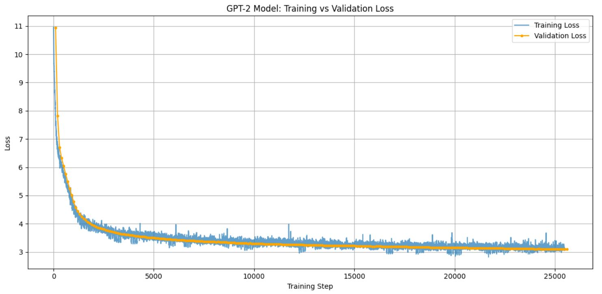

# Reproducing GPT-2 From Scratch Notebooks
## Notebook Versions of Andrej Karpathy's NanoGPT Tutorial
### Includes additional diagnostic code, shard randomization and checkpoint handling
#### Dr John Hughes


These Notebooks were put together as a companion to Andrej Karpathy's excellent step-by-step YouTube walkthrough showing how to build a GPT-2 from scratch: [**Let's reproduce GPT-2 (124M)**](https://www.youtube.com/watch?v=l8pRSuU81PU).

##### Notebooks
- [Reproducing-GPT2-Part-1.ipynb](notebooks/Reproducing-GPT2-Part-1.ipynb)
- [Reproducing-GPT2-Part-2.ipynb](notebooks/Reproducing-GPT2-Part-2.ipynb)
- [Reproducing-GPT2-Part-3.ipynb](notebooks/Reproducing-GPT2-Part-3.ipynb)

#### Training vs. Validation Loss when trained on FineWeb-edu dataset


### Quickstart
```bash
git clone https://github.com/DrJohnHughes/Reproducing-GPT2-from-Scratch.git
cd Reproducing-GPT2-from-Scratch
```
#### Option A: GPU (recommended)
```bash
conda env create -f environment-gpu.yml
conda activate gpt2-repro-gpu
jupyter lab
```
##### pip alternative for GPU users (skip if you used conda above)
For GPU install CUDA build of torch first (example: CUDA 12.1)
```bash
pip install --index-url https://download.pytorch.org/whl/cu121 torch torchvision torchaudio
```
then the rest without re-resolving torch deps
```bash
pip install -r requirements.txt --no-deps
```
#### Verify GPU (CUDA) support in Python
```python
import torch
print("torch", torch.__version__, "| cuda:", torch.cuda.is_available())
```
If this prints cuda: True, you’re using the GPU build; if False, you’ll run on CPU.

#### Option B: CPU
```bash
conda env create -f environment-cpu.yml
conda activate gpt2-repro-cpu
jupyter lab
```

#### Andrej Karpathy's Scripts are Reproduced here

Andrej's accompanying GitHub repository, [**build-nanogpt**](https://github.com/karpathy/build-nanogpt) contains the final python script built during the tutorial walkthrough and two helper scripts. Those scripts are also reproduced in this repository (MIT licensed; original notices retained). Please also refer to Andrej's [**README.md**](https://github.com/karpathy/build-nanogpt/blob/master/README.md).

Andrej's scripts include:
- **train_gpt2.py**: The final GPT-2 code built during the tutorial
- **hellaswag.py**: Code to run the HellaSwag evaluation covered at the very end of the tutorial
- **fineweb_process.py**: My edited version of the code to download and tokenize the FineWeb-edu dataset which is used to train the model (original: **fineweb.py**)

At the time I worked through the GPT-2 build in June 2025 Andrej's **fineweb.py** script didn't work because the FineWeb-edu dataset had been relocated and renamed. It is possible Andrej has since updated his code but this version should work -- unless the source dataset is altered again! To run this script from the repo root in a Python shell simply type:
```bash
python python/fineweb_process.py
```
By default it writes shards to a subdirectory called `FineWeb-edu`.

#### Notebooks

This repository adds Notebooks that capture Andrej's workflow in various stages of completion. As Andrej rewrites and rearranges the GPT-2 code multiple times these Notebooks should be beneficial to anyone following along with the tutorial. The Notebooks also contain extensive documentation and notes. It is worth noting that Andrej was careful to git commit his work at various stages of completion providing another way to monitor how the GPT was put together.

#### Working Through the Tutorial Line-by-Line

While you could just look through Andrej's finished script to learn about the transformer architecture used in GPT-2, I can't express enough how informative it is to work through the build from scratch line-by-line as you follow along with the tutorial. You will come away with a deep understanding of some very important and complex Deep Learning subjects.

The subject matter is challenging in places but extremely well explained by Andrej. Some concepts are covered in greater details in earlier Language Model tutorials that Andrej made. The **Let's reproduce GPT-2 (124M)** tutorial is actually the 10th in a series of tutorials on Language Models. Depending on your level of experience you may benefit from watching some of the earlier videos before attempting this one.

#### Additions

In addition to showing the stages of Andrej's development, these Notebooks add a method to randomize the ordering that the data is read per epoch. Diagnostic code is used to generate a plot of normalization vs Standard Deviation. This revealed a single large spike in the data. Additional code was written to investigate the cause of the spike.

The Notebooks also show how to save out a checkpoint for a model and how to restart from a checkpoint. Automatic checkpoint saving after a set number of training steps has been added to the code so that training can be restarted at the last good checkpoint if there is a power failure or computer crash.

The Notebooks seem to be consistent with Andrej's build as they achieve almost exactly the same results that Andrej does using the evaluation techniques discussed at the end of the tutorial.

#### Repo Structure
```
├─ assets/
│ ├─ ErrorSpike.jpg
│ ├─ Tensor-cropped-mantissa.jpg
│ ├─ TensorFlow32-format.jpg
│ ├─ Training-Run-2.jpg
│ └─ Training-Run-3.jpg
├─ data/
│ ├─ input.txt                    # Tiny Shakespeare dataset
│ ├─ spike_inspect_output.txt     # Text from region of norm spike
├─ notebooks/
│ ├─ Reproducing-GPT2-Part-1.ipynb
│ ├─ Reproducing-GPT2-Part-2.ipynb
│ └─ Reproducing-GPT2-Part-3.ipynb
├─ python/
│ ├─ LICENSE                      # Andrej Karpathy MIT License
│ ├─ fineweb_process.py
│ ├─ hellaswag.py                 # From Let's reproduce GPT-2 (124M) tutorial
│ └─ train_gpt2.py                # From Let's reproduce GPT-2 (124M) tutorial
├─ environment-gpu.yml
├─ environment-cpu.yml
├─ requirements.txt
├─ .gitignore
├─ LICENSE
└─ README.md
```
